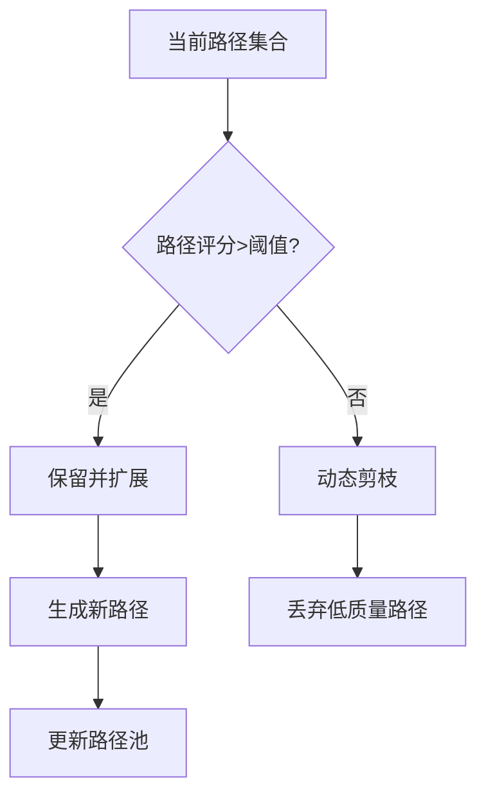

借鉴 thing on graph 的方法，我希望从实现《多跳推理》的方法，目前的思路如下：

1. 使用 gnn 根据问题和 topic entity 识别出哪些节点可能为《关键节点》，选择 topk 的关键节点作为锚点
2. 从 topic eneity 出发，不断增长 hop 数，直到 hop 跳内能够有关键节点，
3. 发现所有的 hop 跳~hop+a跳内能从现有路径集合到关键节点的路径，使用 bert 等模型提取路径的特征并和问题做相似度匹配，选择 topN 跳路径输入到大模型中，让大模型来打分
4. 如果大模型认为当前路径可以得出答案，那么给出答案并且选择推理的路径，如果大模型认为当前推理路径不能给出答案，那么保留大模型打分中最高的 topZ 条路径，重复步骤 2，直到大模型认为当前的信息足够或者达到最大迭代次数 L。

**两阶段验证机制**：
    1. 使用轻量级验证模型（如微调 BERT）进行初步过滤
    2. 仅通过初筛的路径提交给 LLM 评分

**层次化图划分**:
- 预先生成子图分区，将搜索限制在相关子图内
